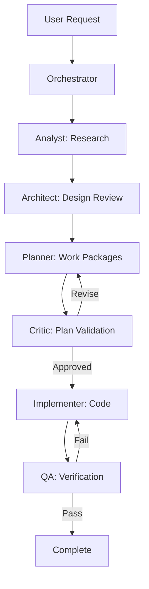
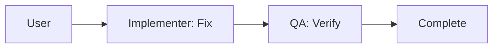
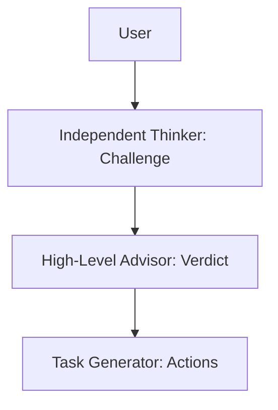

# Agent System Documentation

> **Version**: 1.1
> **Last Updated**: 2025-12-13
> **Based on**: groupzer0/vs-code-agents concepts adapted for enterprise .NET workflows

---

## Overview

This repository uses a coordinated multi-agent system for software development. Specialized agents handle different responsibilities with explicit handoff protocols and persistent memory using `cloudmcp-manager`.

## Quick Start

### For Users

1. Start with `@orchestrator` for complex, multi-step tasks
2. Use specific agents for focused work (e.g., `@implementer` for coding)
3. Let agents hand off to each other following the protocol

### For Agents

1. **Retrieve memory** at session start: `cloudmcp-manager/memory-search_nodes`
2. **Read context**: This file, `CLAUDE.md`, `.github/copilot-instructions.md`
3. **Execute** per your agent instructions
4. **Store learnings** at milestones: `cloudmcp-manager/memory-add_observations`
5. **Handoff** to next agent per protocol

---

## Agent Catalog

### Primary Workflow Agents

| Agent | Role | Best For | Output Directory |
|-------|------|----------|------------------|
| **orchestrator** | Task coordination | Complex multi-step tasks | N/A (routes to others) |
| **analyst** | Pre-implementation research | Root cause analysis, requirements | `.agents/analysis/` |
| **architect** | Design governance | ADRs, technical decisions | `.agents/architecture/` |
| **planner** | Work package creation | Epic breakdown, milestones | `.agents/planning/` |
| **implementer** | Code execution | Production code, tests | Source files |
| **critic** | Plan validation | Review before implementation | `.agents/critique/` |
| **qa** | Test verification | Test strategy, coverage | `.agents/qa/` |
| **roadmap** | Strategic vision | Epic definition, prioritization | `.agents/roadmap/` |

### Support Agents

| Agent | Role | Best For |
|-------|------|----------|
| **memory** | Context continuity | Cross-session persistence |
| **skillbook** | Skill management | Learned strategy updates |
| **devops** | CI/CD pipelines | Build automation, deployment |
| **security** | Vulnerability assessment | Threat modeling, secure coding |
| **independent-thinker** | Assumption challenging | Alternative viewpoints |
| **high-level-advisor** | Strategic decisions | Prioritization, unblocking |
| **retrospective** | Reflector/learning | Outcome analysis, skill extraction |
| **explainer** | Documentation | PRDs, technical specs |
| **task-generator** | Task decomposition | Breaking epics into tasks |

---

## Workflow Patterns

### Standard Feature Development



### Quick Fix Path



### Strategic Decision Path



---

## Memory System

All agents use `cloudmcp-manager` memory tools for cross-session continuity.

### Memory Operations

| Operation | Tool | Purpose |
|-----------|------|---------|
| Search | `cloudmcp-manager/memory-search_nodes` | Find relevant context |
| Retrieve | `cloudmcp-manager/memory-open_nodes` | Get specific entities |
| Create | `cloudmcp-manager/memory-create_entities` | Store new knowledge |
| Update | `cloudmcp-manager/memory-add_observations` | Add to existing entities |
| Link | `cloudmcp-manager/memory-create_relations` | Connect related concepts |

### Entity Naming Conventions

| Type | Pattern | Example |
|------|---------|---------|
| Feature | `Feature-[Name]` | `Feature-Authentication` |
| Decision | `ADR-[Number]` | `ADR-001` |
| Pattern | `Pattern-[Name]` | `Pattern-StrategyTax` |
| Lesson | `Lesson-[Topic]-[Date]` | `Lesson-Caching-2025-01` |
| Problem | `Problem-[Name]` | `Problem-RaceCondition` |
| Solution | `Solution-[Name]` | `Solution-Locking` |

### What to Store

**DO Store:**

- Agent performance observations
- Successful patterns and approaches
- Failed approaches with reasons
- Project conventions discovered
- Strategic decisions and rationale

**DON'T Store:**

- Task-specific details (handled in conversation)
- File-specific implementations (too granular)
- Single-use solutions (not generalizable)

---

## Handoff Protocol

### Standard Handoff

1. **Announce**: "Completing [task]. Handing off to [agent] for [purpose]"
2. **Save Artifacts**: Store outputs in appropriate `.agents/` directory
3. **Update Memory**: Store summary using `cloudmcp-manager/memory-add_observations`
4. **Route**: Use `#runSubagent` or explicit delegation

### Segue Handling

When work requires detour:

```markdown
- [x] Step 1: Completed
- [ ] Step 2: Current <- PAUSED for segue
  - [ ] SEGUE 2.1: Route to analyst for investigation
  - [ ] SEGUE 2.2: Implement fix
  - [ ] SEGUE 2.3: Validate
  - [ ] RESUME: Complete Step 2
- [ ] Step 3: Future
```

### Conflict Resolution

When agents disagree:

1. Route to `independent-thinker` for analysis
2. If unresolved, escalate to `high-level-advisor`
3. Present tradeoffs with clear recommendation
4. Do NOT blend contradictory outputs without resolution

---

## Directory Structure

```text
.agents/
├── AGENT-SYSTEM.md        # This file
├── AGENT-INSTRUCTIONS.md  # Task execution protocol
├── HANDOFF.md             # Session-to-session context
├── analysis/              # Analyst outputs
│   └── NNN-[topic]-analysis.md
├── architecture/          # Architect outputs (ADRs)
│   └── ADR-NNN-[decision].md
├── planning/              # Planner outputs
│   ├── PRD-[feature].md
│   ├── NNN-[plan]-plan.md
│   └── TASKS-[feature].md
├── critique/              # Critic outputs
│   └── NNN-[doc]-critique.md
├── qa/                    # QA outputs
│   ├── NNN-[feature]-test-strategy.md
│   └── NNN-[feature]-test-report.md
├── roadmap/               # Roadmap outputs
│   └── product-roadmap.md
├── retrospective/         # Retrospective outputs
│   └── YYYY-MM-DD-[scope].md
├── devops/                # DevOps documentation
├── security/              # Security documentation
│   ├── TM-NNN-[feature].md    # Threat models
│   └── SR-NNN-[scope].md      # Security reports
└── sessions/              # Session logs
    └── YYYY-MM-DD-[context].md
```

---

## Routing Heuristics

| Task Type | Primary Agent | Fallback |
|-----------|---------------|----------|
| C# implementation | implementer | - |
| Architecture review | architect | analyst |
| Task decomposition | task-generator | planner |
| Challenge assumptions | independent-thinker | critic |
| Test strategy | qa | implementer |
| Research/investigation | analyst | - |
| Strategic decisions | high-level-advisor | roadmap |
| Documentation/PRD | explainer | planner |
| CI/CD pipelines | devops | implementer |
| Security review | security | analyst |
| Post-project learning | retrospective | analyst |

---

## Agent Invocation

### In VS Code (Copilot Chat)

```text
@orchestrator Help me implement [feature]
@implementer Fix the bug in [file]
@analyst Investigate why [behavior]
```

### In Claude Code CLI

Use the Task tool with `subagent_type` matching agent name:

- `subagent_type=analyst`
- `subagent_type=architect`
- etc.

### Via Subagent

```text
#runSubagent with subagentType=implementer
```

---

## Best Practices

### For All Agents

1. **Memory First**: Retrieve context before multi-step reasoning
2. **Document Outputs**: Save artifacts to appropriate directories
3. **Clear Handoffs**: Announce next agent and purpose
4. **Store Learnings**: Update memory at milestones

### For Orchestrator

1. **Plan Before Routing**: Identify agent sequence upfront
2. **Track Progress**: Maintain TODO list throughout
3. **Resolve Conflicts**: Don't proceed with contradictory outputs
4. **Synthesize Results**: Combine agent outputs coherently

### For Implementation

1. **Follow Plans**: The plan document is authoritative
2. **Surface Ambiguities**: Ask before assuming
3. **Test Everything**: No skipping hard tests
4. **Commit Atomically**: Small, conventional commits

---

## Troubleshooting

### Agent Not Responding

1. Check agent file exists in prompts directory
2. Verify agent name matches exactly
3. Try direct invocation without orchestration

### Memory Issues

1. Search with broader terms if initial query fails
2. Use `cloudmcp-manager/memory-read_graph` to inspect state
3. Check entity naming matches conventions

### Workflow Stuck

1. Route to `independent-thinker` for fresh perspective
2. Escalate to `high-level-advisor` for prioritization
3. Use `retrospective` to analyze what went wrong

---

## Self-Improvement System

The agent system includes a continuous improvement loop based on [kayba-ai/agentic-context-engine](https://github.com/kayba-ai/agentic-context-engine) concepts.

### Feedback Loop

```text
Execution → Reflection → Skill Update → Improved Execution
    ↑                                          ↓
    └──────────────────────────────────────────┘
```

### Key Agents

| Agent | Role in Improvement |
|-------|---------------------|
| **retrospective** | Reflector - analyzes outcomes, extracts learnings |
| **skillbook** | Skill Manager - maintains and updates learned strategies |
| **memory** | Persistence - stores skills via cloudmcp-manager |

### Skill Citation Protocol

All agents should cite skills when applying learned strategies:

**During Execution:**

```markdown
**Applying**: Skill-Build-001
**Strategy**: Use /m:1 /nodeReuse:false for CI builds
**Expected Outcome**: Avoid file locking errors
```

**After Execution:**

```markdown
**Result**: Build succeeded
**Skill Validated**: Yes
**Feedback**: Effective for multi-targeting
```

### Atomicity Requirements

All learnings must be atomic (scored 0-100%):

| Score | Quality | Action |
|-------|---------|--------|
| 95-100% | Excellent | Add immediately |
| 70-94% | Good | Accept with minor refinement |
| 40-69% | Needs Work | Refine before adding |
| <40% | Rejected | Too vague |

**Penalties:**

- Compound statements ("and", "also"): -15% each
- Vague terms ("generally", "sometimes"): -20% each
- Length > 15 words: -5% per extra word

### Skill Operations

| Operation | When | Requirements |
|-----------|------|--------------|
| **ADD** | New strategy | Atomicity >70%, no duplicates |
| **UPDATE** | Refine existing | Evidence of improvement |
| **TAG** | Mark effectiveness | helpful/harmful/neutral with evidence |
| **REMOVE** | Eliminate | Evidence of harm OR >70% duplicate |

### Skill Entity Format

```json
{
  "skill_id": "Skill-Build-001",
  "statement": "Use /m:1 /nodeReuse:false for CI builds",
  "context": "Windows multi-framework builds",
  "evidence": "Session 39 - fixed CI failures",
  "atomicity_score": 88,
  "tag": "helpful",
  "impact_score": 9
}
```

### Deduplication Protocol

Before adding any new skill:

1. Search: `cloudmcp-manager/memory-search_nodes` with skill keywords
2. Compare: Find most similar existing skill
3. Decide:
   - Similarity <70%: ADD new skill
   - Similarity >70%: UPDATE existing skill
   - Exact duplicate: REJECT

### Evidence-Based Tagging

| Tag | Meaning | Evidence Required |
|-----|---------|-------------------|
| **helpful** | Contributed to success | Specific positive execution |
| **harmful** | Caused failure | Specific negative execution |
| **neutral** | No measurable impact | Use without observable effect |

---

## Version History

| Version | Date | Changes |
|---------|------|---------|
| 1.1 | 2025-12-13 | Added self-improvement system (retrospective, skillbook) |
| 1.0 | 2025-12-13 | Initial agent system based on groupzer0/vs-code-agents |
