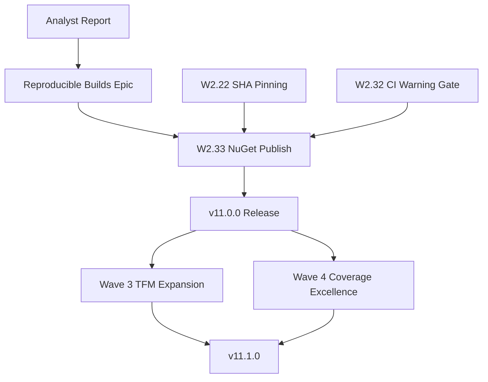

# Product Roadmap

## Master Product Objective

Enable enterprise teams (100+ developers) to efficiently query and manage Azure DevOps work items through a secure, maintainable, and cross-platform .NET library deployed in Kubernetes environments.

## Vision Statement

QWIQ v11.0.0 delivers a production-ready library with enterprise-grade supply chain security, reproducible builds, and modern .NET runtime support (net8.0/net9.0/net10.0) while maintaining backward compatibility for legacy TFS deployments.

---

## Current Release: v11.0.0

### P0 - Critical (Must Have)

| Epic                    | User Value                                                                                                    | Status      |
| ----------------------- | ------------------------------------------------------------------------------------------------------------- | ----------- |
| Supply Chain Security   | Enterprise teams can deploy with confidence knowing all dependencies are verified and builds are reproducible | In Progress |
| CI Warning Gate (W2.32) | Prevent quality regressions by blocking builds with warnings                                                  | Planned     |
| SHA Pinning (W2.22)     | Protect against supply chain attacks via GitHub Actions                                                       | Planned     |

### P1 - Important (Should Have)

| Epic                            | User Value                                                                                                | Status      |
| ------------------------------- | --------------------------------------------------------------------------------------------------------- | ----------- |
| Reproducible Builds Integration | Consumers can verify package integrity and trace builds back to source with byte-for-byte reproducibility | Planned     |
| TFM Expansion (W3.1)            | Run in Kubernetes containers with net9.0/net10.0 support                                                  | Planned     |
| 70% Code Coverage (Wave 4)      | High confidence in production deployments through comprehensive testing                                   | In Progress |

### P2 - Nice to Have

| Epic                    | User Value                                                  | Status  |
| ----------------------- | ----------------------------------------------------------- | ------- |
| Package Signing (W3.10) | Cryptographic verification of package authenticity          | Planned |
| Observability (W3.8)    | Production monitoring via ILogger/OpenTelemetry integration | Planned |

---

## Epic: Reproducible Builds Integration

**As a** package consumer or security auditor
**I want** QWIQ packages to be reproducible and verifiable
**So that** I can trust the supply chain integrity and verify that published packages match the source code exactly

### Vision Statement

Integrate the official .NET Foundation `DotNet.ReproducibleBuilds` package to standardize QWIQ's reproducible build configuration. This strengthens supply chain security posture by enabling byte-for-byte build verification, complementing existing SLSA provenance and SBOM generation. Enterprise security teams can verify package integrity during security audits, and CI/CD pipelines gain automatic build environment detection.

### Strategic Outcome

This Epic delivers:

1. **Supply Chain Trust**: Reproducible builds enable third parties to verify that published packages were built from the claimed source code, a requirement for SLSA Level 3+ compliance.

2. **Audit Readiness**: Enterprise security reviews increasingly require reproducible build evidence. This positions QWIQ for adoption in regulated environments (finance, healthcare, government).

3. **Maintenance Simplification**: Consolidates manual reproducibility settings into a community-maintained package that evolves with .NET best practices.

4. **Developer Experience**: Contributors familiar with the .NET ecosystem will recognize the standard approach, reducing onboarding friction.

### Success Criteria

- [ ] `DotNet.ReproducibleBuilds` v1.2.39+ added to Directory.Packages.props
- [ ] Package reference added to Directory.Build.props with PrivateAssets="All"
- [ ] Existing explicit settings (DebugType=portable, SourceLink) preserved and take precedence
- [ ] CI build passes with 0 errors, 0 warnings
- [ ] Package validation (`dotnet validate package local`) succeeds for all .nupkg files
- [ ] No regression in existing reproducibility (packages remain deterministic)
- [ ] Documentation updated to note reproducible build capability

### Scope

**In Scope:**

- Add DotNet.ReproducibleBuilds package reference
- Verify no conflicts with existing settings
- Update documentation

**Out of Scope:**

- Removing existing manual reproducibility settings (redundant but not harmful)
- Package signing (separate Epic: W3.10)
- Build validation tooling for consumers

### Priority

**P1 - Important** with imminent execution

**Justification:**

1. **Low effort, high value**: 2 lines of configuration yield standardized reproducibility
2. **Alignment with v11.0.0 goals**: Complements existing SLSA provenance and SBOM
3. **Enterprise requirement**: Security audits increasingly require reproducibility evidence
4. **Foundation package**: Official .NET Foundation maintenance ensures long-term support
5. **Pre-release timing**: Should be integrated before v11.0.0 NuGet publish

### Dependencies

| Dependency                  | Type         | Status                       |
| --------------------------- | ------------ | ---------------------------- |
| Analyst Report Complete     | Prerequisite | Complete                     |
| W2.22 SHA Pinning           | Parallel     | Planned                      |
| W2.33 NuGet v11.0.0 Publish | Successor    | Blocked until this completes |

### Risks

| Risk                        | Likelihood | Impact | Mitigation                                                |
| --------------------------- | ---------- | ------ | --------------------------------------------------------- |
| DebugType override conflict | Low        | Medium | Existing explicit settings take precedence; verify in CI  |
| Build time increase         | Very Low   | Low    | Package is build-time only, no runtime impact             |
| Version conflicts           | Very Low   | Low    | PrivateAssets="All" prevents transitive dependency issues |
| Multi-TFM issues            | Very Low   | Low    | Package is TFM-agnostic per analysis report               |

---

## Future Releases

### v11.1.0 (Post-Production Stabilization)

- SOAP client deprecation migration guide (W3.6)
- Container deployment documentation (W5.2)
- Performance benchmarks baseline (W5.8)

### v12.0.0 (Breaking Changes)

- SOAP client removal
- netstandard2.0 deprecation
- ILogger/OpenTelemetry native integration

---

## Dependencies

---

## Success Metrics

| Metric                          | Target | Current            |
| ------------------------------- | ------ | ------------------ |
| Reproducible build verification | Pass   | Not yet integrated |
| SLSA provenance attached        | Yes    | Yes                |
| SBOM generated                  | Yes    | Yes                |
| Code coverage                   | 70%    | 51.1%              |
| Build warnings                  | 0      | 0                  |

---

## Changelog

| Date       | Change                         | Rationale                                                    |
| ---------- | ------------------------------ | ------------------------------------------------------------ |
| 2025-12-14 | Created product roadmap        | Roadmap agent initialization                                 |
| 2025-12-14 | Added Reproducible Builds Epic | Strategic alignment with v11.0.0 supply chain security goals |
