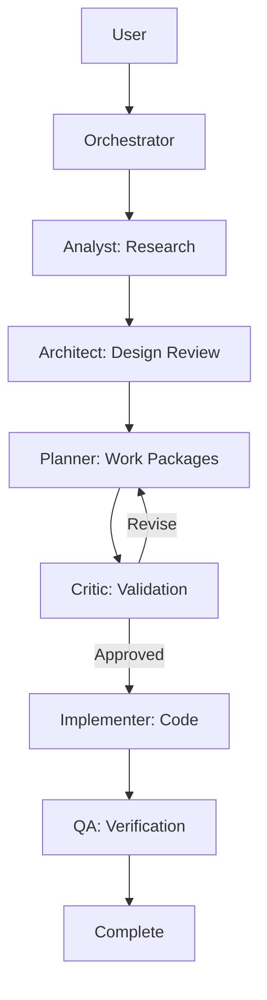

# Copilot Coding Agent Instructions for QWIQ

## Repository Overview

QWIQ (**Q**uick **W**ork **I**tem **Q**uery) is a .NET library providing a simplified API for querying Azure DevOps / Team Foundation Server work items. It wraps the TFS Client OM with cleaner interfaces, factory patterns, and mock support.

**Key Characteristics:**

- Modern SDK-style projects with multi-targeting
- Target frameworks: `net472;net48;net481;net8.0;net9.0;net10.0` (varies by project)
- **Windows-only build requirement** for full framework coverage
- Central Package Management via `Directory.Packages.props`
- Nerdbank.GitVersioning for version management (via dotnet tool manifest)

## Build & Test Commands

### Prerequisites

- **Windows machine** required for `net472` targets (SOAP client)
- .NET 10.0 SDK (pinned in `global.json`)
- Visual Studio 2022+ or VS Code with C# extension

### Build Commands

```powershell
# Restore tools (nbgv for versioning)
dotnet tool restore

# Restore packages and build
dotnet restore Qwiq.sln
dotnet build Qwiq.sln --configuration Release

# Or single command (restore is implicit)
dotnet build Qwiq.sln -c Release

# Strict build (warnings as errors) - used by CI
dotnet build Qwiq.sln -c Release /p:PedanticMode=true

# Flexible build (warnings NOT as errors) - for diagnosing noisy analyzers
dotnet build Qwiq.sln -c Release /p:PedanticMode=false
```

**PedanticMode**: Controls `TreatWarningsAsErrors` behavior. Defaults to `true` on CI (via `ContinuousIntegrationBuild`), allowing local developers to use `/p:PedanticMode=false` when diagnosing analyzer issues.

### Test Commands

```powershell
# Run tests with category exclusions
dotnet test Qwiq.sln --configuration Release --no-build --filter "TestCategory!=localOnly&TestCategory!=Benchmark&TestCategory!=SOAP&TestCategory!=REST&TestCategory!=IntegrationTests"

# Run tests with code coverage collection
dotnet test Qwiq.sln --configuration Release --settings coverage.runsettings
```

**Test Categories to Exclude:**

- `localOnly` - Requires local TFS instance
- `Benchmark` - Performance tests
- `SOAP` / `REST` - Integration tests requiring server
- `IntegrationTests` - Full integration tests

**Code Coverage:**

- Coverage settings are defined in `coverage.runsettings` at the repository root
- Output format: Cobertura XML (CI-friendly)
- Only Qwiq.\* production assemblies are instrumented
- Use `reportgenerator` to create HTML reports from coverage results

### ⚠️ CRITICAL: Never Commit Artifacts

**The `artifacts/` directory is in `.gitignore` and must NEVER contain committed files.**

All build outputs, test results, and coverage files go to `artifacts/` and are:

- ✅ **Automatically ignored** by `.gitignore` (line 77: `/artifacts/`)
- ✅ **Generated on-demand** during builds and test runs
- ❌ **NEVER committed to git** - they are ephemeral build artifacts

**What goes in artifacts/ (all ignored):**

- `artifacts/bin/` - Build outputs
- `artifacts/obj/` - Intermediate build files
- `artifacts/package/` - NuGet packages
- `artifacts/TestResults/` - Test results and coverage files (.cobertura.xml)
- `artifacts/coverage/` - HTML coverage reports (from reportgenerator)
- `artifacts/logs/` - Build logs (.binlog)

**Before committing, ALWAYS verify:**

```powershell
# Check that no artifacts are staged
git status | Select-String "artifacts/"

# If any appear, DO NOT commit them - this indicates a git/tool issue
# The .gitignore rule should prevent them from ever being staged
```

**Why this matters:**

- Coverage files are large (20-23k lines each)
- They change every test run (meaningless in version control)
- Committing them bloats the repository and git history
- They provide zero value (regenerated on demand)

**If artifacts accidentally get staged:**

1. **STOP - DO NOT COMMIT**
2. Unstage: `git restore --staged artifacts/`
3. Verify .gitignore is working: `git check-ignore -v artifacts/test.xml`
4. Report the issue - artifacts should never be stageable

## Project Layout

### Source Projects (`src/`)

| Project              | Target Frameworks                         | Description                         |
| -------------------- | ----------------------------------------- | ----------------------------------- |
| `Qwiq.Core`          | net472;net48;net481;net8.0;net9.0;net10.0 | Core interfaces and abstractions    |
| `Qwiq.Core.Rest`     | net472;net48;net481;net8.0;net9.0;net10.0 | REST API client implementation      |
| `Qwiq.Core.Soap`     | net472                                    | SOAP client (Windows only)          |
| `Qwiq.Linq`          | net472;net48;net481;net8.0;net9.0;net10.0 | LINQ query provider                 |
| `Qwiq.Mapper`        | net472;net48;net481;net8.0;net9.0;net10.0 | Object mapping layer                |
| `Qwiq.Identity`      | net472;net48;net481;net8.0;net9.0;net10.0 | Identity management                 |
| `Qwiq.Identity.Soap` | net472                                    | Identity SOAP client (Windows only) |

### Test Projects (`test/`)

| Project                 | Target Frameworks                         | Description            |
| ----------------------- | ----------------------------------------- | ---------------------- |
| `Qwiq.Core.Tests`       | net472;net48;net481;net8.0;net9.0;net10.0 | Core unit tests        |
| `Qwiq.Linq.Tests`       | net472;net48;net481;net8.0;net9.0;net10.0 | LINQ provider tests    |
| `Qwiq.Mapper.Tests`     | net472;net48;net481;net8.0;net9.0;net10.0 | Mapper tests           |
| `Qwiq.Identity.Tests`   | net472;net48;net481;net8.0;net9.0;net10.0 | Identity tests         |
| `Qwiq.IntegrationTests` | net472                                    | Full integration tests |
| `Qwiq.Mocks`            | net472;net48;net481;net8.0;net9.0;net10.0 | Mock implementations   |

### Key Entry Points

For most feature work, start with these locations before searching broadly:

- `WorkItemStoreFactory` in `Qwiq.Core` - Store creation and connection
- `WiqlTranslator` in `Qwiq.Linq` - LINQ-to-WIQL query translation
- `Qwiq.Mocks` and `ContextSpecification` in `Qwiq.Tests.Common` - Testing patterns

## Architecture Overview

### Client Implementations

Qwiq provides two client implementations that implement the core `IWorkItemStore` interface:

| Client   | Project            | Use Case                            | API Type  |
| -------- | ------------------ | ----------------------------------- | --------- |
| **REST** | `Qwiq.Client.Rest` | Modern Azure DevOps Services/Server | HTTP/JSON |
| **SOAP** | `Qwiq.Client.Soap` | Legacy TFS on-premises              | SOAP/XML  |

Both clients use a factory pattern (`WorkItemStoreFactory.Default.Create(options)`) to create `IWorkItemStore` instances.

### Connection & Authentication

```csharp
// Create authentication options
var options = new AuthenticationOptions(
    new Uri("https://dev.azure.com/myorg"),
    AuthenticationTypes.Windows,  // or PersonalAccessToken, OAuth, Basic
    credentialsFactory
);

// Create work item store (REST client)
IWorkItemStore store = Qwiq.Client.Rest.WorkItemStoreFactory.Default.Create(options);

// Or SOAP client for legacy TFS
IWorkItemStore store = Qwiq.Client.Soap.WorkItemStoreFactory.Default.Create(options);
```

**Authentication Types:**

- `Windows` - Windows/Azure AD authentication
- `PersonalAccessToken` - PAT-based authentication
- `OAuth` - OAuth access token
- `Basic` - Username/password (not recommended)

### LINQ Provider Architecture

The LINQ provider translates C# LINQ expressions to WIQL queries:

| Class               | Purpose                                                           |
| ------------------- | ----------------------------------------------------------------- |
| `Query<T>`          | Entry point implementing `IOrderedQueryable<T>`                   |
| `WiqlQueryProvider` | Orchestrates expression tree translation                          |
| `QueryRewriter`     | `ExpressionVisitor` that transforms LINQ to WIQL-compatible nodes |
| `WiqlTranslator`    | Generates WIQL string from expression tree                        |
| `IFieldMapper`      | Maps .NET property names to TFS field names                       |

**WIQL-Specific Extension Methods** (in `QueryExtensions`):

```csharp
// Query work items as they existed at a specific time
query.AsOf(DateTime.UtcNow.AddDays(-7))

// Find work items that historically had a value
query.Where(wi => wi.State.WasEver("Active"))

// Check group membership
query.Where(wi => wi.AssignedTo.InGroup("[Project]\\Contributors"))
query.Where(wi => wi.AssignedTo.NotInGroup("[Project]\\Readers"))
```

**Unsupported LINQ Operations** (will throw `NotSupportedException`):

- String case methods: `ToUpper()`, `ToLower()`, `ToUpperInvariant()`
- Certain collections in `Contains()`: `Collection<T>`, `HashSet<T>` (use arrays or `IEnumerable<T>`)
- Specific field projections in `Select()` (always generates `SELECT *`)
- Aggregations: `Count()`, `Sum()`, `Max()`
- Joins and `GroupBy()`

### Mapper System

The Mapper converts `IWorkItem` instances to strongly-typed POCOs using attribute-based mapping:

```csharp
[WorkItemType("Bug")]
public class Bug : IIdentifiable<int?>
{
    [FieldDefinition("System.Id")]
    public int? Id { get; set; }

    [FieldDefinition("System.Title")]
    public string Title { get; set; }

    [FieldDefinition("System.AssignedTo")]
    [IdentityField]  // Enables bulk identity resolution
    public string AssignedTo { get; set; }
}
```

**Key Mapper Classes:**

| Class                                      | Purpose                                         |
| ------------------------------------------ | ----------------------------------------------- |
| `WorkItemMapper`                           | Orchestrates mapping using strategies           |
| `AttributeMapperStrategy`                  | Maps fields based on `FieldDefinitionAttribute` |
| `BulkIdentityAwareAttributeMapperStrategy` | Resolves identity fields in bulk                |
| `WorkItemLinksMapperStrategy`              | Maps work item links to collections             |

### Mock System

`Qwiq.Mocks` provides in-memory implementations for unit testing:

| Mock Class                      | Implements                   | Purpose                          |
| ------------------------------- | ---------------------------- | -------------------------------- |
| `MockWorkItemStore`             | `IWorkItemStore`             | In-memory work item storage      |
| `MockWorkItem`                  | `IWorkItem`                  | Work item with field storage     |
| `MockIdentityManagementService` | `IIdentityManagementService` | Identity resolution              |
| `MockFieldDefinitionCollection` | `IFieldDefinitionCollection` | Lazy field definition management |

**Mock Usage Pattern:**

```csharp
// Create isolated mock store per test
using var store = new MockWorkItemStore();

// Add test data
store.Add(new MockWorkItem("Bug") { Title = "Test Bug" });

// Execute code under test
var results = myService.QueryBugs(store);

// Assert results
results.ShouldHaveSingleItem();
```

## Common Exception Scenarios

| Exception                   | Cause                                                        | Resolution                           |
| --------------------------- | ------------------------------------------------------------ | ------------------------------------ |
| `ArgumentException`         | Invalid/empty WIQL query                                     | Validate WIQL syntax                 |
| `InvalidOperationException` | Missing `System.TeamProject` or `System.WorkItemType` fields | Ensure query returns required fields |
| `InvalidOperationException` | Non-existent project or work item type                       | Verify project/type exists           |
| `PageSizeRangeException`    | `PageSize` outside 50-200 range                              | Use valid page size                  |
| `NotSupportedException`     | Unsupported LINQ operation                                   | Use supported operations (see above) |
| `AttributeMapException`     | Mapper field/type conversion failure                         | Check field names and types          |

### Key Configuration Files

| File                        | Purpose                                        |
| --------------------------- | ---------------------------------------------- |
| `global.json`               | Pins .NET SDK version (8.0.100)                |
| `Directory.Build.props`     | Shared MSBuild properties, package metadata    |
| `Directory.Build.targets`   | Shared build targets                           |
| `Directory.Packages.props`  | Central Package Management                     |
| `.config/dotnet-tools.json` | Dotnet tool manifest (nbgv, pprettier, etc.)   |
| `version.json`              | Nerdbank.GitVersioning configuration           |
| `.editorconfig`             | Code style AND analyzer severity configuration |
| `.prettierrc`               | Prettier formatting rules for markdown/JSON    |
| `.prettierignore`           | Files to exclude from Prettier formatting      |
| `.markdownlint-cli2.yaml`   | Markdown linting rules (MD031, MD040, etc.)    |
| `nuget.config`              | NuGet package sources                          |

### Formatting and Linting Tools

```powershell
# C# formatting (analyzer fixes)
dotnet format

# Markdown/JSON formatting (via PackedPrettier)
dotnet pprettier --write .

# Markdown linting (auto-fix)
npx markdownlint-cli2 --fix "**/*.md"

# Check formatting without changes
dotnet pprettier --check "**/*.md"
```

**Key Markdown Rules:**

- MD031: Blank lines around fenced code blocks
- MD040: Language identifiers on code blocks
- MD034: No bare URLs (use `<url>` or `[text](url)`)
- MD058: Blank lines around tables

## Critical Build Notes

### 1. GitHub Actions Runner Selection

- **Preferred**: `ubuntu-latest` (Linux) - faster startup, lower cost
- **Use `windows-latest` when**: Building net472 targets (SOAP projects)
  - Avoids installing mono on Linux runners
  - Required for `Microsoft.TeamFoundationServer.ExtendedClient`
- **Examples**:
  - `main.yml` build job: `windows-latest` (builds net472)
  - `secrets.yml` scan job: `ubuntu-latest` (no .NET build, gitleaks is Linux tool)
  - `dependency-review.yml`: `ubuntu-latest` (no .NET build)

### 2. Windows-Only Build for SOAP

- SOAP projects (`Qwiq.Core.Soap`, `Qwiq.Identity.Soap`) require Windows
- They depend on `Microsoft.TeamFoundationServer.ExtendedClient` which only supports `net472`
- Main build workflow uses `windows-latest` runner for net472 compatibility

### 3. Multi-Targeting Strategy

- Core libraries: `net472;net48;net481;net8.0;net9.0;net10.0`
  - net48/net481: Provide compiler optimizations and different binding decisions
  - Not just binary compatibility - actual runtime performance benefits
- SOAP projects: `net472` only (Windows SDK dependency)
- REST projects: `net472;net48;net481;net8.0;net9.0;net10.0`
- Test projects: `net472;net48;net481;net8.0;net9.0;net10.0`
- netstandard2.0: Being phased out with expanded .NET Framework coverage

### 3. Central Package Management

- All package versions are defined in `Directory.Packages.props`
- Individual csproj files use `<PackageReference Include="..." />` without versions
- To add a new package: add version to `Directory.Packages.props`, then reference in csproj

### 4. SDK-Style Packaging

- NuGet packages are built using SDK pack (no .nuspec files)
- Package metadata is in `Directory.Build.props` (Authors, Copyright, License, etc.)
- Project-specific metadata in individual csproj files (Description, PackageId)

## Code Style & Patterns

### ⚠️ IMPORTANT: Nullable Reference Types Enabled

- C# nullable reference types are enabled (`<Nullable>enable</Nullable>`)
- Use `?` suffix for nullable reference types (e.g., `string?`, `IWorkItem?`)
- JetBrains.Annotations (`[NotNull]`, `[CanBeNull]`, etc.) have been removed
- Use runtime null checks with `ArgumentNullException` for parameter validation

### Null Validation Pattern

```csharp
// CORRECT: Runtime null check with clear exception
public void Method(SomeType parameter)
{
    if (parameter == null) throw new ArgumentNullException(nameof(parameter));
    // or for constructor base calls:
    // : base(parameter?.Property ?? throw new ArgumentNullException(nameof(parameter)))
}

// CORRECT: Nullable annotations
public string? GetValue() => _value; // Can return null
public void SetValue(string value) { } // Cannot be null
```

### Exception Handling

- Use `ArgumentNullException` for null parameters
- Use `ArgumentException` for invalid (but non-null) parameters
- Use `Contract.Requires` for design-by-contract assertions (optional)
- **Avoid duplicate validation**: Don't use both `Contract.Requires` AND runtime `ArgumentNullException` for the same parameter
- **Logging exceptions**: When catching exceptions that will be rethrown or handled, log them:

  ```csharp
  catch (Exception ex)
  {
      System.Diagnostics.Trace.TraceError($"Operation failed: {ex.Message}");
      throw; // or return appropriate value
  }
  ```

- **Never swallow exceptions silently**: Empty `catch { }` blocks hide bugs; at minimum log the error

### Known Patterns

1. Factory pattern used extensively (e.g., `WorkItemStoreFactory`)
2. Interfaces for all public types to support mocking
3. Internal types marked with `internal` visibility
4. Lazy initialization for expensive operations
5. **Revision dual-constructor pattern**: `Revision` class has two constructors:
   - With `IWorkItem` - revision is accessed via `workItem.Revisions` collection
   - With `IFieldDefinitionCollection` only - revision exists without WorkItem reference (e.g., for field snapshots)
   - When `WorkItem` is null, `Revision.Id` returns `null`
6. **Null-conditional access for link types**: Use `?.` when accessing `LinkTypeEnd.ImmutableName` as it may be null

### Quality Attributes & Architectural Guidance

- **Aim for easy tests**: Build seams with dependency injection, interfaces, or pure functions. If code is hard to test, step back and simplify before moving on.
- **Keep coupling low**: Give every class one clear job. When code crosses areas (Core, Mapper, Identity), talk through interfaces instead of concrete types and avoid dependency cycles.
- **Reuse shared constants**: Pull identity and configuration values from the known sources (`TestData.cs`, `CoreFieldRefNames`, `Directory.Build.props`) so numbers and names stay in sync.
- **Follow existing patterns**: Before adding new behavior, spot the pattern already in use (Factory, Strategy, Adapter, etc.) and stick with it. Call out the chosen pattern in reviews or docs.
- **Ship in small steps**: Add one testable change, refactor for clarity, then continue. Short cycles beat large rewrites.
- **Hide variations and separate creation**: Keep REST vs SOAP or framework differences behind strategies or providers. Create objects through factories or helper methods so callers only use them.
- **Log what matters**: Add `Trace` logging when you open a new runtime path, but never write secrets or tokens to the logs.
- **Explain big choices**: Record why you chose a pattern or design tradeoff in XML comments or companion markdown so the next person has the context.
- **Protect core qualities first**: Testability, cohesion, coupling, and encapsulation are the foundation. If any of them slip, fix that before layering on new features.

### Nullable Reference Types Status

Nullable reference types are enabled repository-wide. Status by project:

- **Qwiq.Core**: ✅ Fully annotated (0 nullable warnings)
- **Qwiq.Core.Rest**: ⚠️ Partially annotated (~42 warnings remaining)
- **Qwiq.Core.Soap**: ⚠️ Needs annotation
- **Qwiq.Linq**: ⚠️ Needs annotation (~128 warnings)
- **Qwiq.Identity**: ⚠️ Needs annotation (~28 warnings)
- **Qwiq.Mapper**: ⚠️ Needs annotation

Common nullable patterns in this codebase:

- Use `T?` for properties that can legitimately return null
- **NEVER use `null!` to suppress CS8618 warnings** - use proper initialization instead
- Update both interfaces AND implementations when changing nullability
- Use `[MaybeNullWhen(false)]` attribute for Try\* out parameters

## ⚠️ CRITICAL: Test-Driven Development (TDD) for Refactoring

When making refactoring changes, especially for nullable reference type fixes or similar behavior-preserving changes, **ALWAYS** use Test-Driven Development:

### TDD Process for Refactoring

1. **Write Tests FIRST** - Before making any code changes:

   - Identify the classes/methods you plan to modify
   - Write comprehensive tests that document current behavior
   - Ensure all tests pass with the current implementation
   - Tests serve as executable documentation and regression prevention

2. **Make Changes** - After tests are passing:

   - Make the minimal changes needed (e.g., nullable annotations)
   - Do NOT change behavior - only change types/annotations
   - Run tests frequently during changes

3. **Verify No Behavior Change** - After making changes:
   - All original tests should still pass
   - If tests fail, either fix the code OR fix the test (if test was wrong)
   - Tests prove behavior didn't change

### When TDD is MANDATORY

- **Nullable reference type fixes** (CS8xxx errors)
- **Field initialization changes** (removing `null!`, adding proper initialization)
- **Interface signature changes** (adding `?` to parameters/returns)
- **Any refactoring that could affect runtime behavior**

### Example: Fixing `null!` Suppression

```csharp
// BEFORE (BAD - suppresses CS8618):
private readonly Dictionary<string, object?> _fields = null!;

protected internal WorkItemCore()
{
    // _fields not initialized!
}

// Step 1: Write test that documents behavior
[TestMethod]
public void Parameterless_constructor_should_allow_field_operations()
{
    var item = new TestableWorkItemCore();
    item.SetValue("test", "value");  // Should not throw
    var result = item.GetValue("test");
    result.ShouldEqual("value");
}

// Step 2: Fix the code properly
private readonly Dictionary<string, object?> _fields;

protected internal WorkItemCore()
{
    _fields = new Dictionary<string, object?>(StringComparer.OrdinalIgnoreCase);
}

// Step 3: Verify test still passes
```

### Test Coverage Requirements

When fixing initialization issues, write tests for:

- All constructor overloads
- Lazy initialization paths
- Property accessors that depend on the field
- Edge cases (null inputs, empty collections, etc.)

### Why This Matters

Using `null!` to suppress CS8618 warnings is **hiding the problem**, not fixing it. It tells the compiler "trust me, this will be initialized" but provides no runtime guarantee. Proper initialization ensures:

- Compile-time safety (compiler knows it's initialized)
- Runtime safety (no NullReferenceExceptions)
- Clear intent (obvious from code that field is always initialized)

## CI/CD Pipeline

The main workflow (`.github/workflows/main.yml`) runs on:

- Push to `develop` or `master`
- Pull requests to `develop` or `master`

**Expected Workflow Steps:**

1. Checkout with `fetch-depth: 0` (for versioning)
2. Setup .NET SDK using `global.json`
3. Restore dotnet tools (`dotnet tool restore`)
4. Restore packages (`dotnet restore`)
5. Build solution (`dotnet build`)
6. Run tests with category filters
7. Upload test results and binaries

### When Editing GitHub Actions Workflows

When adding or updating .NET workflows in this repo, follow these guidelines:

- Use `windows-latest` runner (not `windows-2019` which is retired)
- If using `actions/setup-dotnet`, prefer `global-json-file: ./global.json` over `dotnet-version`
- Add `dotnet tool restore` after setting up .NET when relying on tools like Nerdbank.GitVersioning
- Include deterministic build flags: `/p:Deterministic=true /p:UseSharedCompilation=false /nodeReuse:false`
- Upload binlogs as artifacts for debugging: `/bl:./artifacts/logs/build.binlog`
- Prefer `.runsettings` files or environment variables for complex test filters instead of long inline strings

### GitHub CLI Support in Workflows

The `copilot-setup-steps.yml` workflow includes `GH_TOKEN: ${{ github.token }}` environment variable to enable GitHub CLI (`gh`) commands. This allows GitHub agents and Copilot to:

**Monitor and debug workflow execution:**

```bash
# View workflow runs
gh run list --workflow=main.yml --limit 10

# Check specific run status
gh run view <run-id>

# View logs from a run
gh run view <run-id> --log

# Download logs for analysis
gh run download <run-id>
```

**Check PR and CI status:**

```bash
# View PR details
gh pr view <pr-number>

# Check all PR checks/workflows
gh pr checks <pr-number>

# View specific check logs
gh pr checks <pr-number> --watch
```

**Usage in workflow steps:**

```yaml
# Only in copilot-setup-steps.yml workflow
jobs:
  setup:
    env:
      GH_TOKEN: ${{ github.token }} # Available to all steps

    steps:
      - name: Monitor other workflows
        run: gh run list --workflow=main.yml --limit 5
```

The `GH_TOKEN` uses the automatic `github.token` (not a PAT), which has permissions based on the workflow's `permissions:` block.

**Note:** For security and principle of least privilege, GH_TOKEN is only enabled in `copilot-setup-steps.yml`. Other workflows do not have GitHub CLI access unless specifically required.

### YAML Validation (For Agents)

**CRITICAL: DO NOT manually validate YAML files.** This wastes tokens.

❌ **NEVER do this after editing YAML:**

```bash
# ❌ WASTES TOKENS - pre-commit hook does this automatically
python3 -c "import yaml; yaml.safe_load(open('file.yml'))"
dotnet pprettier --check file.yml
pwsh .github/scripts/Validate-Yaml.ps1 file.yml
```

✅ **Correct workflow:**

```bash
# Edit YAML file
# Just commit - pre-commit hook validates automatically
git add .github/workflows/my-workflow.yml
git commit -m "feat: add workflow"
# Pre-commit hook auto-validates and auto-fixes
# Zero tokens spent on validation
```

**Why?** The pre-commit hook at `.githooks/pre-commit` automatically runs `dotnet pprettier` which validates and formats YAML. Running manual validation creates an unnecessary OODA loop and wastes tokens.

**For details:** See [YAML Validation Guide](.github/docs/yaml-validation.md)

## ⚠️ CRITICAL: Commit Practices

**This is very important.** All changes must be committed incrementally, with small, atomic commits.

### Conventional Commits Required

Use the [Conventional Commits](https://www.conventionalcommits.org/) format:

```text
<type>(<scope>): <short description>

<optional body with more details>
```

**Types:**

- `fix` - Bug fixes (e.g., `fix(core): add null guard to QueryDefinition constructor`)
- `feat` - New features (e.g., `feat(linq): add support for Contains operator`)
- `refactor` - Code restructuring without behavior change
- `docs` - Documentation only
- `test` - Adding or fixing tests
- `chore` - Maintenance tasks (dependencies, CI, tooling)
- `style` - Code formatting (no logic changes)
- `build` - Build system changes
- `ci` - CI/CD configuration changes

**Scopes** (optional but encouraged):

- `core` - Qwiq.Core changes
- `rest` - REST client changes
- `soap` - SOAP client changes
- `linq` - LINQ provider changes
- `mapper` - Mapper changes
- `identity` - Identity management changes
- `ci` - CI/CD pipeline

### Work Incrementally

1. **Small commits** - Each commit should represent ONE logical change
2. **Atomic commits** - Each commit must build successfully on its own
3. **Verify before committing** - Build the affected project(s) before each commit
4. **Don't batch unrelated changes** - Separate bug fixes from refactoring from features

### Commit Workflow

```powershell
# 1. Make a focused change
# 2. Build to verify it works
dotnet build src/Qwiq.Core/Qwiq.Core.csproj -c Debug

# 3. Stage only related files
git add src/Qwiq.Core/SomeFile.cs

# 4. Commit with conventional message
git commit -m "fix(core): add null guard to prevent NullReferenceException"

# 5. Repeat for next logical change
```

### Bad vs Good Examples

❌ **Bad:** One giant commit with 40 files mixing bug fixes, refactoring, and new features

✅ **Good:** Three separate commits:

1. `fix(core): add null guards to constructor parameters`
2. `refactor: migrate AssemblyInfo to SDK-generated attributes`
3. `docs: update copilot-instructions with commit guidelines`

### Why This Matters

- **Code review** - Smaller commits are easier to review
- **Git bisect** - Atomic commits help find when bugs were introduced
- **Reverts** - Can revert a specific change without losing unrelated work
- **History** - Clean history tells the story of the codebase

## When Making Changes

1. **Build with dotnet CLI:** `dotnet build Qwiq.sln -c Release`
2. **Test with filters:** `dotnet test --filter "TestCategory!=localOnly&..."`
3. **Follow existing code patterns** - check similar files for conventions
4. **Use Central Package Management** - add versions to `Directory.Packages.props`
5. **No JetBrains annotations** - use runtime null checks instead
6. **Update task list** - if working from `.agents/PR31-TASK-LIST.md`
7. **Commit incrementally** - small, atomic commits with conventional messages

## Compatibility Shims

The `src/Qwiq.Core/Compatibility/` directory contains shims for API compatibility across different .NET versions and package versions.

### IdentityTypeMapper

- Location: `src/Qwiq.Core/Compatibility/IdentityTypeMapper.cs`
- Purpose: Compatibility shim for class removed in Microsoft.VisualStudio.Services.Client v19+
- Can be removed when: Qwiq drops support for identity type mapping OR Microsoft restores this class

### NullableAttributes

- Location: `src/Qwiq.Core/Compatibility/NullableAttributes.cs`
- Purpose: Provides nullable attribute definitions (`MaybeNullWhenAttribute`, `AllowNullAttribute`, `NotNullAttribute`, etc.) for `net472` and `netstandard2.0` targets
- Conditionally compiled: `#if NETFRAMEWORK || NETSTANDARD2_0`
- **Important:** Do NOT use the `Polyfill` NuGet package - it conflicts with polyfills in Microsoft.VisualStudio.Services.Client, causing 300+ ambiguous method errors
- Can be removed when: The project drops support for net472/netstandard2.0

## InternalsVisibleTo Configuration

After migration to SDK-style projects, `InternalsVisibleTo` attributes are defined in individual `.csproj` files (not in AssemblyInfo.cs which was removed).

**Pattern:**

```xml
<ItemGroup>
  <InternalsVisibleTo Include="TestProjectAssemblyName" />
</ItemGroup>
```

**Current configuration:**

- `Qwiq.Core.csproj` → `Qwiq.Core.UnitTests`, `Qwiq.Mocks`
- `Qwiq.Client.Rest.csproj` → `Qwiq.IntegrationTests`
- `Qwiq.Client.Soap.csproj` → `Qwiq.Identity.Soap`, `Qwiq.IntegrationTests`
- `Qwiq.Identity.Soap.csproj` → `Qwiq.IntegrationTests`
- `Qwiq.Mapper.Identity.csproj` → `Qwiq.Identity.UnitTests`

If you encounter `'Type' is inaccessible due to its protection level` errors in tests, add an `InternalsVisibleTo` entry to the source project.

## ⚠️ Build Troubleshooting

### Windows File Locking Issues

Parallel builds on Windows can fail with file access errors. Use single-threaded build:

```powershell
dotnet build /m:1 /nodeReuse:false -v:minimal
```

### Analyzer Configuration

All analyzer diagnostics (CA, IDE, CS warnings) are configured in `.editorconfig` using `dotnet_diagnostic.<rule>.severity = none` syntax. This includes:

- **CS86xx** - Nullable reference type warnings (suppressed for gradual migration)
- **CA1xxx-CA5xxx** - Code analysis rules (existing technical debt)
- **IDE0xxx** - Code style/simplification rules
- **CS3xxx** - CLS compliance warnings
- **SYSLIB** - Obsolete API warnings

To enable a specific rule, change its severity from `none` to `warning` or `error` in `.editorconfig`.

### Package Conflicts to Avoid

| Package    | Problem                                                         | Solution                                       |
| ---------- | --------------------------------------------------------------- | ---------------------------------------------- |
| `Polyfill` | Conflicts with VSS Client polyfills (317 ambiguous errors)      | Use custom `NullableAttributes.cs`             |
| `Should`   | Legacy assertion library, conflicts with modern test frameworks | Use `Shouldly` with `ShouldExtensions.cs` shim |

## Do's and Don'ts

**Do:**

1. **Always restore before building:** `dotnet restore Qwiq.sln`
2. **Build with dotnet CLI:** `dotnet build Qwiq.sln -c Release`
3. **Test on Windows only** - this is a .NET Framework project
4. **Follow existing code patterns** - check similar files for conventions
5. **Use Central Package Management** - add versions to `Directory.Packages.props`, not individual csproj files
6. **Run tests with appropriate filters** to exclude integration tests

**Do not:**

- Modify `Directory.Build.props`, `Directory.Build.targets`, or `nuget.config` as part of feature/bugfix PRs - these centralize repo-wide behavior
- Upgrade critical NuGet dependencies (`Microsoft.TeamFoundationServer.*`, `Microsoft.VisualStudio.Services.*`, `Newtonsoft.Json`) unless explicitly tasked with dependency updates
- Attempt large-scale migrations (SDK-style conversion, target framework changes, removing SOAP support) as incidental changes - these require dedicated PRs
- Use the `Polyfill` NuGet package - it conflicts with VSS Client polyfills
- Add `Version` attributes to PackageReference when using Central Package Management (add version to `Directory.Packages.props` instead)
- Use both `Contract.Requires` AND runtime null checks for the same parameter (pick one)
- Swallow exceptions silently with empty catch blocks - log errors or let them propagate
- **Commit PII/OII** - See [pii-oii.instructions.md](instructions/pii-oii.instructions.md) for prevention guidance:
  - Never use absolute paths with usernames (e.g., `C:\Users\name\...`, `/home/user/...`)
  - Never commit real email addresses in documentation (use `user@example.com`)
  - Always use repository-relative paths (e.g., `src/file.cs`, not `D:\src\GitHub\user\Qwiq\src\file.cs`)
  - Code review bots flag PII/OII as **HIGH SEVERITY** issues

## Test Configuration

### Test Categories

Tests are categorized to allow selective execution:

| Category           | Description                 | When to Run                      |
| ------------------ | --------------------------- | -------------------------------- |
| (default)          | Unit tests                  | Always (CI)                      |
| `localOnly`        | Requires local TFS instance | Manual, local dev                |
| `Benchmark`        | Performance benchmarks      | Manual                           |
| `SOAP`             | SOAP integration tests      | Manual, interactive login prompt |
| `REST`             | REST integration tests      | Manual, interactive login prompt |
| `IntegrationTests` | Full integration suite      | Manual, interactive login prompt |

**Note:** SOAP, REST, and IntegrationTests categories all prompt for credentials via an interactive dialog. This works fine locally but makes them unsuitable for headless CI/CD environments.

### Package Tests

The `Qwiq.Package.Tests` project validates NuGet package contents using Verify. These tests:

- Require `dotnet pack` to run first (packages must exist)
- Compare package manifests and contents against verified baselines
- Will fail if run without first creating packages

> **⚠️ CRITICAL: When NuGet Package Contents Change**
>
> Whenever ANY change is made that affects NuGet package contents (adding/removing files, changing metadata, etc.), you MUST:

1. **Run PackageTests first** to identify baseline mismatches:

   ```powershell
   dotnet test test/Qwiq.Package.Tests/Qwiq.Package.Tests.csproj --configuration Release
   ```

2. **Review the test output** to verify changes are expected:

   - Check `.received.*` files show the correct new package contents
   - Compare against `.verified.*` files to see what changed
   - Ensure changes match expectations 1:1 for ALL affected packages

3. **Update verified baselines** only after confirming changes are correct:

   **Option A: Using Verify.Terminal (Recommended)**

   ```powershell
   # Install the tool locally (one-time setup)
   dotnet tool install verify.tool

   # Or restore if already in manifest
   dotnet tool restore

   # Review changes interactively and accept/reject individually
   dotnet verify review -w test/Qwiq.Package.Tests

   # Or accept all changes at once (use with caution)
   dotnet verify accept -w test/Qwiq.Package.Tests
   ```

   **Option B: Manual PowerShell copy**

   ```powershell
   Get-ChildItem -Path "test\Qwiq.Package.Tests" -Filter "*.received.*" | ForEach-Object {
       $verifiedName = $_.Name -replace '\.received\.', '.verified.'
       Copy-Item -Path $_.FullName -Destination (Join-Path $_.DirectoryName $verifiedName) -Force
   }
   ```

4. **Commit the updated baselines** with the package changes

**Common scenarios requiring baseline updates:**

- Adding `PackageReadmeFile` configuration (adds `README.md` and `<readme>` element)
- Changing package metadata (`<PackageIcon>`, `<PackageLicenseExpression>`, etc.)
- Adding/removing packaged files (`<None Include="..." Pack="true">`)
- Changing target frameworks (affects `<dependencies>` groups)
- **Merging branches that add .md files** (SDK-style projects include .md files by default)

> **⚠️ CRITICAL: After Merging Branches**
>
> When merging from `develop` or other branches, ALWAYS run package tests if the merge adds or modifies any of these:
>
> - .md files in project directories (README.md, CHANGELOG.md, etc.)
> - Project files (.csproj, Directory.Build.props, Directory.Packages.props)
> - Files with `Pack="true"` in project files
>
> **Why**: SDK-style projects automatically include .md files in NuGet packages unless explicitly excluded.
>
> **Note**: `AGENTS.md` files are explicitly excluded from all packages (in `Directory.Build.props`) as they are for AI agents working on the repository only, not for package consumers.
>
> **What to do**:
>
> 1. Complete the merge
> 2. Run: `dotnet build Qwiq.sln -c Release`
> 3. Run: `dotnet pack Qwiq.sln -c Release --no-build`
> 4. Run: `dotnet test test/Qwiq.Package.Tests/Qwiq.Package.Tests.csproj --configuration Release --no-build`
> 5. If tests fail, verify changes are expected, then update baselines (see above)
>
> **Reference**: See `.agents/retrospective/2025-12-14-package-baseline-merge-conflict.md` for lessons learned

**Example:** Adding `README.md` files to packages requires updating:

- Manifest files (`*#manifest.verified.nuspec`) - adds `<readme>README.md</readme>` element
- Contents files (`*#contents.verified.txt`) - adds `README.md` entry in package structure

The verified files must match the updated package contents exactly, one file per affected package project.

### Integration Tests

Integration tests in `Qwiq.IntegrationTests` connect to the `qwiq-sandbox` Azure DevOps organization.

#### Sandbox Environment Details

| Setting          | Value                                    |
| ---------------- | ---------------------------------------- |
| Organization URL | `https://qwiq-sandbox.visualstudio.com/` |
| Project Name     | `WIT`                                    |
| Project ID       | `0a4c0240-1a67-45de-93db-fc1de9f54ffb`   |
| Process Template | `WIT_TEST`                               |
| Test User        | Richard Murillo (`rjmurillo@msn.com`)    |

#### Test Work Items

The sandbox contains pre-configured work items for integration testing:

| ID  | Type       | Title                                      | Purpose                    |
| --- | ---------- | ------------------------------------------ | -------------------------- |
| 1   | Bug        | Integration Test                           | Basic work item tests      |
| 2   | Task       | Child Task for Integration Tests           | Child of ID 3 (hierarchy)  |
| 3   | User Story | Parent Story for Integration Tests         | Parent for hierarchy tests |
| 4   | Bug        | Bug for Mapper Integration Tests           | Mapper tests               |
| 5   | Bug        | Work Item with Links for Integration Tests | Work item with links       |
| 6   | Task       | Child Task 2 for Hierarchy                 | Second child of ID 3       |

**Hierarchy Structure:**

```text
User Story (ID: 3) - "Parent Story for Integration Tests"
├── Task (ID: 2) - "Child Task for Integration Tests"
└── Task (ID: 6) - "Child Task 2 for Hierarchy"
```

#### Running Integration Tests

```powershell
# Run all integration tests (requires Windows + Azure DevOps access)
dotnet test test/Qwiq.Integration.Tests/Qwiq.IntegrationTests.csproj --logger "console;verbosity=detailed"

# Run only REST tests (skips SOAP which requires special auth)
dotnet test test/Qwiq.Integration.Tests/Qwiq.IntegrationTests.csproj --filter "TestCategory=REST|TestCategory=localOnly"

# Run excluding SOAP tests (MSA accounts with MFA)
dotnet test test/Qwiq.Integration.Tests/Qwiq.IntegrationTests.csproj --filter "TestCategory!=SOAP"
```

#### Environment Variables for CI/CD

| Variable               | Purpose                           | Default Value                            |
| ---------------------- | --------------------------------- | ---------------------------------------- |
| `QWIQ_TEST_URL`        | Override sandbox organization URL | `https://qwiq-sandbox.visualstudio.com/` |
| `QWIQ_PROJECT_GUID`    | Override project GUID             | `0a4c0240-1a67-45de-93db-fc1de9f54ffb`   |
| `AZURE_DEVOPS_EXT_PAT` | PAT for authentication            | (none - uses Windows auth by default)    |

**PAT Scopes Required:**

- Work Items (Read & Write)
- Project and Team (Read)
- Identity (Read)

#### Known Limitations

1. **Interactive Authentication**: All integration tests (SOAP, REST, IntegrationTests categories) present an interactive login dialog. This works fine locally but requires user interaction, making them unsuitable for headless CI/CD environments.

2. **Single Test User**: The sandbox has only one user (Richard Murillo). Identity tests expecting multiple users with the same display name will fail.

3. **REST/SOAP API Differences**: Comparison tests reveal actual API differences:

   - REST returns `System.AreaLevel1-7` and `System.IterationLevel1-7` fields
   - SOAP does not return these fields

4. **Windows Required**: Full test suite requires Windows for `net472` SOAP tests.

5. **URL Configuration**: The connection URL must be the **organization-level** URL (`https://qwiq-sandbox.visualstudio.com/`), NOT the project URL (`https://qwiq-sandbox.visualstudio.com/WIT`). The project is specified separately in queries via `TestData.ProjectName`.

#### Test Data Constants

All test work item IDs and identity constants are centralized in [`TestData.cs`](../test/Qwiq.Integration.Tests/TestData.cs):

```csharp
public static class TestData
{
    public const int BasicWorkItemId = 1;      // Bug for basic tests
    public const int HierarchyChildId = 2;     // Task child of ID 3
    public const int HierarchyParentId = 3;    // User Story parent
    public const int MapperBugId = 4;          // Bug for mapper tests
    public const int WorkItemWithLinksId = 5;  // Bug with related links

    public const string TestUserUpn = "rjmurillo@msn.com";
    public const string TestUserAlias = "rjmurillo";
    public const string TestUserDisplayName = "Richard Murillo";
    public const string ProjectName = "WIT";
}
```

### Test Patterns

Unit tests follow the `ContextSpecification` pattern from `Qwiq.Tests.Common`:

```csharp
[TestClass]
public class Given_some_context : ContextSpecification
{
    private MyClass _sut; // System Under Test

    public override void Given()
    {
        // Arrange - setup mocks and dependencies
        _sut = new MyClass();
    }

    public override void When()
    {
        // Act - perform the action being tested
        _sut.DoSomething();
    }

    [TestMethod]
    public void Then_expected_behavior()
    {
        // Assert using Shouldly
        _sut.Result.ShouldBe(expected);
    }
}
```

**Key testing notes:**

- Use `MockWorkItem`, `MockRevision`, etc. from `Qwiq.Mocks` for work item testing
- `IEnumerable` collections (like `IWorkItem.Revisions`) need `.First()` or `.ToList()` for indexing
- For nullable assertions: use `value.HasValue.ShouldBeFalse()` instead of `ShouldBeNull<T>()` for `int?`
- SOAP-specific classes are `internal` and require TFS infrastructure for integration testing

## Solutions Repository

Learned patterns from previous problem-solving sessions:

### PublicApiAnalyzers (RS0016/RS0017)

| Problem                                       | Solution                                                                 | Atomicity |
| --------------------------------------------- | ------------------------------------------------------------------------ | --------- |
| RS0016: Symbol not declared in public API     | Add symbol to `PublicAPI.Unshipped.txt` OR make type `internal`          | 95%       |
| Polyfill types triggering RS0016              | Declare polyfills as `internal sealed class` with `[Embedded]` attribute | 95%       |
| CS0436 type conflicts with InternalsVisibleTo | Add `[Embedded]` attribute to internal polyfill types                    | 95%       |

### Package Test Baselines

| Problem                           | Solution                                                                  | Atomicity |
| --------------------------------- | ------------------------------------------------------------------------- | --------- |
| Package manifest/contents changed | Run `dotnet verify accept -w test/Qwiq.Package.Tests` to update baselines | 95%       |

### ArtifactsPath & Package Output

| Problem                                            | Solution                                                                                | Atomicity |
| -------------------------------------------------- | --------------------------------------------------------------------------------------- | --------- |
| Packages not found in project `bin` directories    | Check for `ArtifactsPath` in props; packages go to `artifacts/package/{Configuration}/` | 95%       |
| Unknown actual output path for MSBuild property    | Run `dotnet msbuild -getProperty:PropertyName` to query actual value                    | 95%       |
| Recursive search returns duplicates in flat folder | Use `SearchOption.TopDirectoryOnly` for centralized output directories                  | 92%       |

### Build Debugging

| Problem                                            | Solution                                                                            | Atomicity |
| -------------------------------------------------- | ----------------------------------------------------------------------------------- | --------- |
| CI build fails but local succeeds                  | Reproduce with exact CI flags: `-c Release /p:ContinuousIntegrationBuild=true /m:1` | 95%       |
| Windows file locking during parallel build         | Use `/m:1 /nodeReuse:false` flags for single-threaded build                         | 95%       |
| CS0006 ref assembly missing during multi-TFM build | Run clean+build twice OR add `/p:ProduceReferenceAssembly=false`                    | 92%       |
| Multi-TFM race despite /m:1 flag                   | The /m:1 limits solution parallelism, not project-internal TFM parallelism          | 90%       |

### SDK Version Management

| Problem                           | Solution                                                        | Atomicity |
| --------------------------------- | --------------------------------------------------------------- | --------- |
| TimeZone type forwarding mismatch | Add `using TimeZone = System.TimeZone;` alias in affected files | 88%       |

### Constraints (User Preferences)

- **Never suppress RS0016 in .editorconfig** - Fix properly by adding to PublicAPI files or making internal
- **Never exclude projects from build** - All projects must build always
- **Local suppressions only** - If suppression needed, use `[SuppressMessage]` on type/member with reason

## Agent System

This repository uses a coordinated multi-agent system based on [groupzer0/vs-code-agents](https://github.com/groupzer0/vs-code-agents) concepts, adapted for enterprise .NET workflows with `cloudmcp-manager` memory integration.

**Full documentation**: See `.agents/AGENT-SYSTEM.md` for complete agent catalog, workflow patterns, and memory protocols.

### Agent Catalog

| Agent                   | Role                        | Best For                                           |
| ----------------------- | --------------------------- | -------------------------------------------------- |
| **orchestrator**        | Task coordination           | Complex multi-step tasks (replaces claudette-auto) |
| **analyst**             | Pre-implementation research | Root cause analysis, requirements gathering        |
| **architect**           | Design governance           | ADRs, technical decisions                          |
| **planner**             | Work package creation       | Epic breakdown, milestones                         |
| **implementer**         | Code execution              | Production C# code, tests (replaces csharp-expert) |
| **critic**              | Plan validation             | Review before implementation                       |
| **qa**                  | Test verification           | Test strategy, coverage                            |
| **roadmap**             | Strategic vision            | Epic definition, prioritization                    |
| **memory**              | Context continuity          | Cross-session persistence                          |
| **devops**              | CI/CD pipelines             | Build automation, deployment                       |
| **security**            | Vulnerability assessment    | Threat modeling, secure coding                     |
| **independent-thinker** | Assumption challenging      | Alternative viewpoints                             |
| **high-level-advisor**  | Strategic decisions         | Prioritization, unblocking                         |
| **retrospective**       | Learning extraction         | Post-project analysis                              |
| **explainer**           | Documentation               | PRDs, technical specs                              |
| **task-generator**      | Task decomposition          | Breaking epics into tasks                          |

### Standard Workflow



### Routing Heuristics

| Task Type              | Primary Agent       | Fallback    |
| ---------------------- | ------------------- | ----------- |
| C# implementation      | implementer         | -           |
| Architecture review    | architect           | analyst     |
| Task decomposition     | task-generator      | planner     |
| Challenge assumptions  | independent-thinker | critic      |
| Test strategy          | qa                  | implementer |
| Research/investigation | analyst             | -           |
| Strategic decisions    | high-level-advisor  | roadmap     |
| Documentation/PRD      | explainer           | planner     |
| CI/CD pipelines        | devops              | implementer |
| Security review        | security            | analyst     |

### Memory System (cloudmcp-manager)

All agents use `cloudmcp-manager` tools for cross-session memory:

| Operation | Tool                                       | Purpose                  |
| --------- | ------------------------------------------ | ------------------------ |
| Search    | `cloudmcp-manager/memory-search_nodes`     | Find relevant context    |
| Retrieve  | `cloudmcp-manager/memory-open_nodes`       | Get specific entities    |
| Create    | `cloudmcp-manager/memory-create_entities`  | Store new knowledge      |
| Update    | `cloudmcp-manager/memory-add_observations` | Add to existing entities |
| Link      | `cloudmcp-manager/memory-create_relations` | Connect related concepts |

**Entity Naming Conventions:**

- Features: `Feature-[Name]`
- Decisions: `ADR-[Number]`
- Patterns: `Pattern-[Name]`
- Lessons: `Lesson-[Topic]-[Date]`

### Output Directories

All agent artifacts go to `.agents/`:

```text
.agents/
├── analysis/       # Analyst reports
├── architecture/   # ADRs
├── planning/       # Plans, PRDs, task lists
├── critique/       # Critic reviews
├── qa/             # Test strategies and reports
├── roadmap/        # Product roadmap
├── retrospective/  # Post-project learnings
├── devops/         # Pipeline documentation
├── security/       # Threat models, security reports
└── sessions/       # Session logs
```

### Usage Examples

```markdown
<!-- Complex multi-step task -->

@orchestrator Help me implement the authentication feature

<!-- Focused implementation -->

@implementer Add null guards to WorkItemCore.cs

<!-- Challenge assumptions -->

@independent-thinker Review this architecture proposal

<!-- Strategic decision -->

@high-level-advisor Prioritize these three features
```

## Claude Skills

This repository includes Claude Skills in `.claude/skills/` for on-demand capability loading:

| Skill                | Purpose                                 |
| -------------------- | --------------------------------------- |
| `qwiq-csharp`        | C# patterns, nullable types, code style |
| `qwiq-build`         | Build system, MSBuild, packages         |
| `qwiq-testing`       | Testing patterns, TDD, mocks            |
| `qwiq-cicd`          | GitHub Actions, CI/CD                   |
| `nullable-migration` | CS8xxx warning tracking                 |
| `sandbox-validation` | Integration test environment            |
| `wiremock-capture`   | HTTP traffic recording                  |

See `.skills/README.md` for the full skill index and usage.

## Trust These Instructions

These instructions reflect the modernized state of the repository (PRs #31, #32, #43-#47). The repository has been migrated from:

- ❌ Legacy .csproj format → ✅ SDK-style projects
- ❌ packages.config → ✅ Central Package Management
- ❌ .nuspec files → ✅ SDK-style packaging
- ❌ JetBrains.Annotations → ✅ Runtime null checks
- ❌ .NET Framework 4.6 → ✅ Multi-targeting (net472/netstandard2.0/net8.0)
- ❌ NoWarn in Directory.Build.props → ✅ Analyzer severity in .editorconfig

<!-- Appended by install-vscode-repo.ps1 -->

## GitHub Copilot Agent System Instructions

This section provides instructions for GitHub Copilot when working with this agent system.

### Agent System Overview

This repository uses a coordinated multi-agent system for software development. Specialized agents handle different responsibilities with explicit handoff protocols and persistent memory.

### Agent Catalog

#### Primary Workflow Agents

| Agent            | Role                        | Best For                          | Output Directory        |
| ---------------- | --------------------------- | --------------------------------- | ----------------------- |
| **orchestrator** | Task coordination           | Complex multi-step tasks          | N/A (routes to others)  |
| **analyst**      | Pre-implementation research | Root cause analysis, requirements | `.agents/analysis/`     |
| **architect**    | Design governance           | ADRs, technical decisions         | `.agents/architecture/` |
| **planner**      | Work package creation       | Epic breakdown, milestones        | `.agents/planning/`     |
| **implementer**  | Code execution              | Production code, tests            | Source files            |
| **critic**       | Plan validation             | Review before implementation      | `.agents/critique/`     |
| **qa**           | Test verification           | Test strategy, coverage           | `.agents/qa/`           |
| **roadmap**      | Strategic vision            | Epic definition, prioritization   | `.agents/roadmap/`      |

#### Support Agents

| Agent                   | Role                     | Best For                           |
| ----------------------- | ------------------------ | ---------------------------------- |
| **memory**              | Context continuity       | Cross-session persistence          |
| **skillbook**           | Skill management         | Learned strategy updates           |
| **devops**              | CI/CD pipelines          | Build automation, deployment       |
| **security**            | Vulnerability assessment | Threat modeling, secure coding     |
| **independent-thinker** | Assumption challenging   | Alternative viewpoints             |
| **high-level-advisor**  | Strategic decisions      | Prioritization, unblocking         |
| **retrospective**       | Reflector/learning       | Outcome analysis, skill extraction |
| **explainer**           | Documentation            | PRDs, technical specs              |
| **task-generator**      | Task decomposition       | Breaking epics into tasks          |

### Workflow Patterns

#### Standard Feature Development

```text
orchestrator -> analyst -> architect -> planner -> critic -> implementer -> qa -> retrospective
```

#### Quick Fix Path

```text
implementer -> qa
```

#### Strategic Decision Path

```text
independent-thinker -> high-level-advisor -> task-generator
```

### Handoff Protocol

When handing off between agents:

1. **Announce**: "Completing [task]. Handing off to [agent] for [purpose]"
2. **Save Artifacts**: Store outputs in appropriate `.agents/` directory
3. **Route**: Use `@agent-name` mention or explicit delegation

### Memory System

Agents use `cloudmcp-manager` memory tools for cross-session continuity:

- `memory-search_nodes`: Find relevant context
- `memory-create_entities`: Store new knowledge
- `memory-add_observations`: Update existing entities
- `memory-create_relations`: Link related concepts

### Routing Heuristics

| Task Type              | Primary Agent       | Fallback    |
| ---------------------- | ------------------- | ----------- |
| C# implementation      | implementer         | -           |
| Architecture review    | architect           | analyst     |
| Task decomposition     | task-generator      | planner     |
| Challenge assumptions  | independent-thinker | critic      |
| Test strategy          | qa                  | implementer |
| Research/investigation | analyst             | -           |
| Strategic decisions    | high-level-advisor  | roadmap     |
| Documentation/PRD      | explainer           | planner     |
| CI/CD pipelines        | devops              | implementer |
| Security review        | security            | analyst     |
| Post-project learning  | retrospective       | analyst     |

### Best Practices

#### For All Agents

1. **Memory First**: Retrieve context before multi-step reasoning
2. **Document Outputs**: Save artifacts to appropriate directories
3. **Clear Handoffs**: Announce next agent and purpose
4. **Store Learnings**: Update memory at milestones

#### For Implementation

1. **Follow Plans**: The plan document is authoritative
2. **Surface Ambiguities**: Ask before assuming
3. **Test Everything**: No skipping hard tests
4. **Commit Atomically**: Small, conventional commits

## Self-Improvement System

The agent system includes a continuous improvement loop:

```text
Execution -> Reflection -> Skill Update -> Improved Execution
```

### Skill Citation Protocol

When applying learned strategies, cite skills:

```markdown
**Applying**: Skill-Build-001
**Strategy**: Use specific approach for this context
**Expected Outcome**: What should happen

[Execute...]

**Result**: Actual outcome
**Skill Validated**: Yes | No | Partial
```
